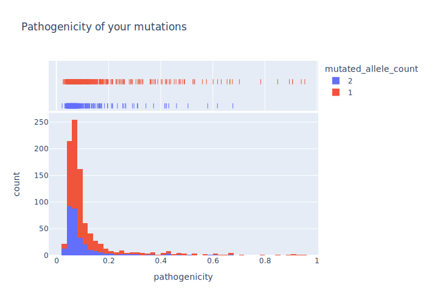

# AlphaMissenseCheck

## How to use

1. Download the [AlphaMissense_hg19.tsv.gz](https://console.cloud.google.com/storage/browser/_details/dm_alphamissense/AlphaMissense_hg19.tsv.gz;tab=live_object) file
2. Download your genome data from 23andme
3. Un-gzip both and rename your genome file as "genome.txt"
4. Run `python check.py`

## Output

The script will print all your mutations with their classification and then print a small summary. Here is mine for reference:

```
Report:
        % Mutated genes: 1.97%
        % Mutated genes with at least 1 allele classified as benign: 93.98%
        % Mutated genes with at least 1 allele classified as ambiguous: 3.94%
        % Mutated genes with at least 1 allele classified as pathogenic: 2.08%
        % Mutated genes with 2 alleles classified as benign: 31.11%
        % Mutated genes with 2 alleles classified as ambiguous: 0.88%
        % Mutated genes with 2 alleles classified as pathogenic: 0.33%
```

